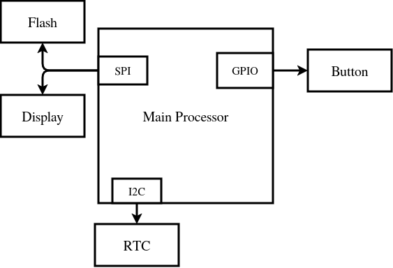

# Hardware Block Diagram

## Key components
- CPU with an 32.768 kHz oscillator
- OLED/E-paper display
- Input button
- Precise Real-Time Clock (~2ppm)
-  ~150-200mAh Li-Po accumulator
- USB-C Li-Po charger with an integrated voltage protection circuit
- 3.7V -> 3.3V voltage regulator

## Diagram

